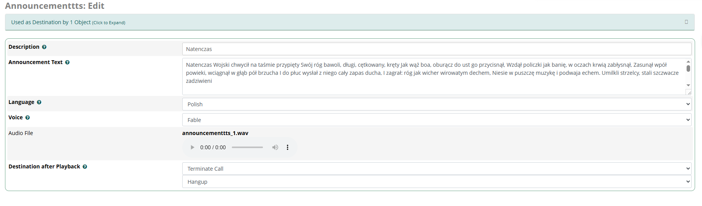

```
 ______             _____  ______   __
|  ____|           |  __ \|  _ \ \ / /
| |__ _ __ ___  ___| |__) | |_) \ V /
|  __| '__/ _ \/ _ \  ___/|  _ < > <
| |  | | |  __/  __/ |    | |_) / . \
|_|  |_|  \___|\___|_|    |____/_/ \_\
Your Open Source Asterisk PBX GUI Solution
```
### What?
Announcement OpenAI TTS - it doesnt replace the TTS module.
Plays back one of the system recordings generated by openAI from your text and then goes to another destination.

### How to use it?
Obtain OpenAI API key from https://platform.openai.com/settings/organization/api-keys - it is something like this: sk-proj-and4lotOfNum8ers8letters

Log into to your FreePBX shell and create file containing your key in /etc/asterisk/openai.key  
 
### For example:
In the Linux shell paste the below command (don't forget to add your openAI  key):

`touch /etc/asterisk/openai.key & echo "-<YOUR_API_KEY_HERE>" > /etc/asterisk/openai.key`

Then go to: Admin -> Module Admin -> Upload and choose Download (From Web) and paste this link: https://github.com/maladrill/announcement_tts/archive/refs/heads/main.zip 

Then click Manage Local Modules and find Anouncements TTS and chose Install and then Process. 


### TODO
Fix the playback of the recording - it doesn't work
Add config page in Settings to hold OpenAI API key

### Issues
Please file bug reports at https://github.com/maladrill/announcement_tts/issues

### Copyright SQS Polska: 
https://sqspolska.pl

### FreePBX

(http://www.freepbx.org/ "FreePBX Home Page") is an open source GUI (graphical user interface) that controls and manages [Asterisk©](http://www.asterisk.org/ "Asterisk Home Page") (PBX). FreePBX is licensed under GPL.
[FreePBX](http://www.freepbx.org/ "FreePBX Home Page") is a completely modular GUI for Asterisk written in PHP and Javascript. Meaning you can easily write any module you can think of and distribute it free of cost to your clients so that they can take advantage of beneficial features in [Asterisk](http://www.asterisk.org/ "Asterisk Home Page")

### Setting up a FreePBX system
[See our WIKI](http://wiki.freepbx.org/display/FOP/Install+FreePBX)
### License
[This modules code is licensed as GPLv3+](http://www.gnu.org/licenses/gpl-3.0.txt)
### Contributing
To contribute code or modules back into the [FreePBX](http://www.freepbx.org/ "FreePBX Home Page") ecosystem you must fully read our Code License Agreement. We are not able to look at or accept patches or code of any kind until this document is filled out. Please take a look at [http://wiki.freepbx.org/display/DC/Code+License+Agreement](http://wiki.freepbx.org/display/DC/Code+License+Agreement) for more information

